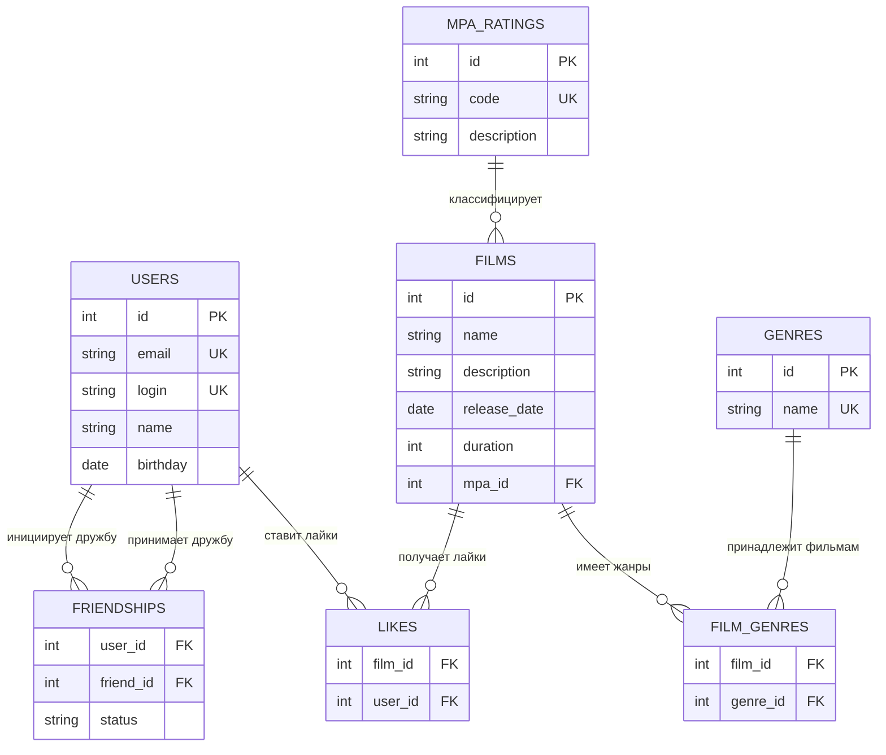

# java-filmorate
Template repository for Filmorate project.

## Схема базы данных

Проект Filmorate использует реляционную базу данных для хранения информации о пользователях, фильмах, их жанрах и рейтингах, а также для управления системой дружбы и лайков.

### ER-диаграмма



### Описание таблиц

#### USERS
Хранит информацию о пользователях системы.
- `id` - первичный ключ
- `email` - уникальный email пользователя
- `login` - уникальный логин пользователя
- `name` - имя пользователя (может быть пустым, тогда используется login)
- `birthday` - дата рождения

#### FILMS
Хранит информацию о фильмах.
- `id` - первичный ключ
- `name` - название фильма
- `description` - описание фильма (максимум 200 символов)
- `release_date` - дата релиза (не раньше 28.12.1895)
- `duration` - продолжительность в минутах
- `mpa_id` - внешний ключ на таблицу MPA_RATINGS

#### GENRES
Справочная таблица жанров фильмов.
- `id` - первичный ключ
- `name` - название жанра (Комедия, Драма, Мультфильм, Триллер, Документальный, Боевик)

#### MPA_RATINGS
Справочная таблица рейтингов MPA.
- `id` - первичный ключ
- `code` - код рейтинга (G, PG, PG-13, R, NC-17)
- `description` - описание рейтинга

#### FILM_GENRES
Связующая таблица для связи многие-ко-многим между фильмами и жанрами.
- `film_id` - внешний ключ на таблицу FILMS
- `genre_id` - внешний ключ на таблицу GENRES
- Составной первичный ключ (film_id, genre_id)

#### LIKES
Связующая таблица для связи многие-ко-многим между пользователями и фильмами (лайки).
- `film_id` - внешний ключ на таблицу FILMS
- `user_id` - внешний ключ на таблицу USERS
- Составной первичный ключ (film_id, user_id)

#### FRIENDSHIPS
Связующая таблица для связи многие-ко-многим между пользователями (дружба).
- `user_id` - внешний ключ на таблицу USERS (инициатор дружбы)
- `friend_id` - внешний ключ на таблицу USERS (получатель запроса)
- `status` - статус дружбы (UNCONFIRMED, CONFIRMED)
- Составной первичный ключ (user_id, friend_id)

### Примеры SQL-запросов

#### Получение всех фильмов с жанрами и рейтингом MPA
```sql
SELECT f.id, f.name, f.description, f.release_date, f.duration,
       mr.code as mpa_code, mr.description as mpa_description,
       STRING_AGG(g.name, ', ') as genres
FROM films f
LEFT JOIN mpa_ratings mr ON f.mpa_id = mr.id
LEFT JOIN film_genres fg ON f.id = fg.film_id
LEFT JOIN genres g ON fg.genre_id = g.id
GROUP BY f.id, f.name, f.description, f.release_date, f.duration, mr.code, mr.description;
```

#### Получение топ N популярных фильмов
```sql
SELECT f.id, f.name, f.description, f.release_date, f.duration,
       mr.code as mpa_code, mr.description as mpa_description,
       COUNT(l.user_id) as likes_count
FROM films f
LEFT JOIN mpa_ratings mr ON f.mpa_id = mr.id
LEFT JOIN likes l ON f.id = l.film_id
GROUP BY f.id, f.name, f.description, f.release_date, f.duration, mr.code, mr.description
ORDER BY likes_count DESC
LIMIT ?;
```

#### Получение списка друзей пользователя
```sql
SELECT u.id, u.email, u.login, u.name, u.birthday
FROM users u
JOIN friendships f ON u.id = f.friend_id
WHERE f.user_id = ? AND f.status = 'CONFIRMED';
```

#### Получение общих друзей двух пользователей
```sql
SELECT u.id, u.email, u.login, u.name, u.birthday
FROM users u
JOIN friendships f1 ON u.id = f1.friend_id
JOIN friendships f2 ON u.id = f2.friend_id
WHERE f1.user_id = ? AND f1.status = 'CONFIRMED'
  AND f2.user_id = ? AND f2.status = 'CONFIRMED';
```

#### Добавление лайка фильму
```sql
INSERT INTO likes (film_id, user_id) VALUES (?, ?);
```

#### Добавление запроса в друзья
```sql
INSERT INTO friendships (user_id, friend_id, status) VALUES (?, ?, 'UNCONFIRMED');
```

#### Подтверждение дружбы
```sql
UPDATE friendships 
SET status = 'CONFIRMED' 
WHERE user_id = ? AND friend_id = ?;
```

#### Получение фильмов по жанру
```sql
SELECT f.id, f.name, f.description, f.release_date, f.duration,
       mr.code as mpa_code, mr.description as mpa_description
FROM films f
JOIN film_genres fg ON f.id = fg.film_id
JOIN genres g ON fg.genre_id = g.id
LEFT JOIN mpa_ratings mr ON f.mpa_id = mr.id
WHERE g.name = ?;
```

#### Получение фильмов по рейтингу MPA
```sql
SELECT f.id, f.name, f.description, f.release_date, f.duration,
       mr.code as mpa_code, mr.description as mpa_description
FROM films f
JOIN mpa_ratings mr ON f.mpa_id = mr.id
WHERE mr.code = ?;
```

### Особенности проектирования

1. **Нормализация**: Все таблицы приведены к третьей нормальной форме (3NF)
2. **Связи**: Использованы связующие таблицы для реализации связей многие-ко-многим
3. **Целостность**: Все внешние ключи обеспечивают ссылочную целостность
4. **Производительность**: Составные индексы на связующих таблицах для быстрого поиска
5. **Бизнес-логика**: Схема поддерживает все требования приложения:
   - Хранение фильмов с множественными жанрами
   - Система рейтингов MPA
   - Дружба с подтверждением
   - Лайки фильмов
   - Поиск популярных фильмов
   - Поиск общих друзей