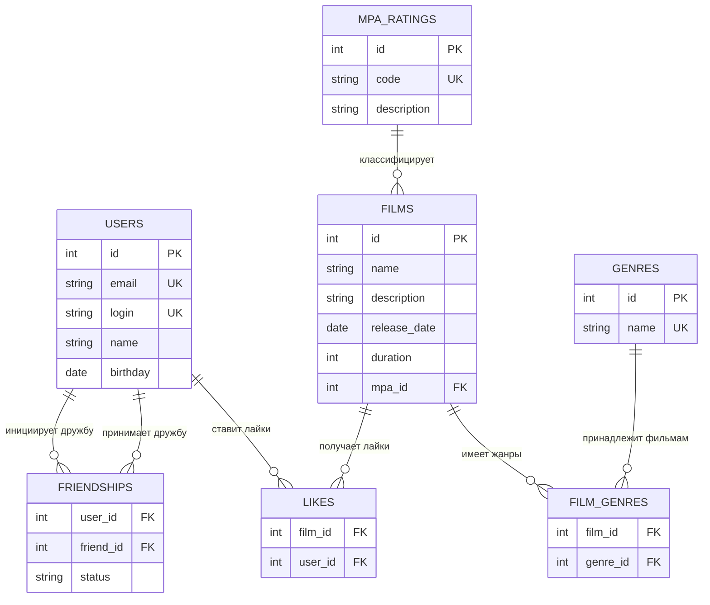

### ER-диаграмма

### Описание таблиц

#### USERS
Хранит информацию о пользователях системы.
- `id` - первичный ключ
- `email` - уникальный email пользователя
- `login` - уникальный логин пользователя
- `name` - имя пользователя (может быть пустым, тогда используется login)
- `birthday` - дата рождения

#### FILMS
Хранит информацию о фильмах.
- `id` - первичный ключ
- `name` - название фильма
- `description` - описание фильма (максимум 200 символов)
- `release_date` - дата релиза (не раньше 28.12.1895)
- `duration` - продолжительность в минутах
- `mpa_id` - внешний ключ на таблицу MPA_RATINGS

#### GENRES
Справочная таблица жанров фильмов.
- `id` - первичный ключ
- `name` - название жанра (Комедия, Драма, Мультфильм, Триллер, Документальный, Боевик)

#### MPA_RATINGS
Справочная таблица рейтингов MPA.
- `id` - первичный ключ
- `code` - код рейтинга (G, PG, PG-13, R, NC-17)
- `description` - описание рейтинга

#### FILM_GENRES
Связующая таблица для связи многие-ко-многим между фильмами и жанрами.
- `film_id` - внешний ключ на таблицу FILMS
- `genre_id` - внешний ключ на таблицу GENRES
- Составной первичный ключ (film_id, genre_id)

#### LIKES
Связующая таблица для связи многие-ко-многим между пользователями и фильмами (лайки).
- `film_id` - внешний ключ на таблицу FILMS
- `user_id` - внешний ключ на таблицу USERS
- Составной первичный ключ (film_id, user_id)

#### FRIENDSHIPS
Связующая таблица для связи многие-ко-многим между пользователями (дружба).
- `user_id` - внешний ключ на таблицу USERS (инициатор дружбы)
- `friend_id` - внешний ключ на таблицу USERS (получатель запроса)
- `status` - статус дружбы (UNCONFIRMED, CONFIRMED)
- Составной первичный ключ (user_id, friend_id)