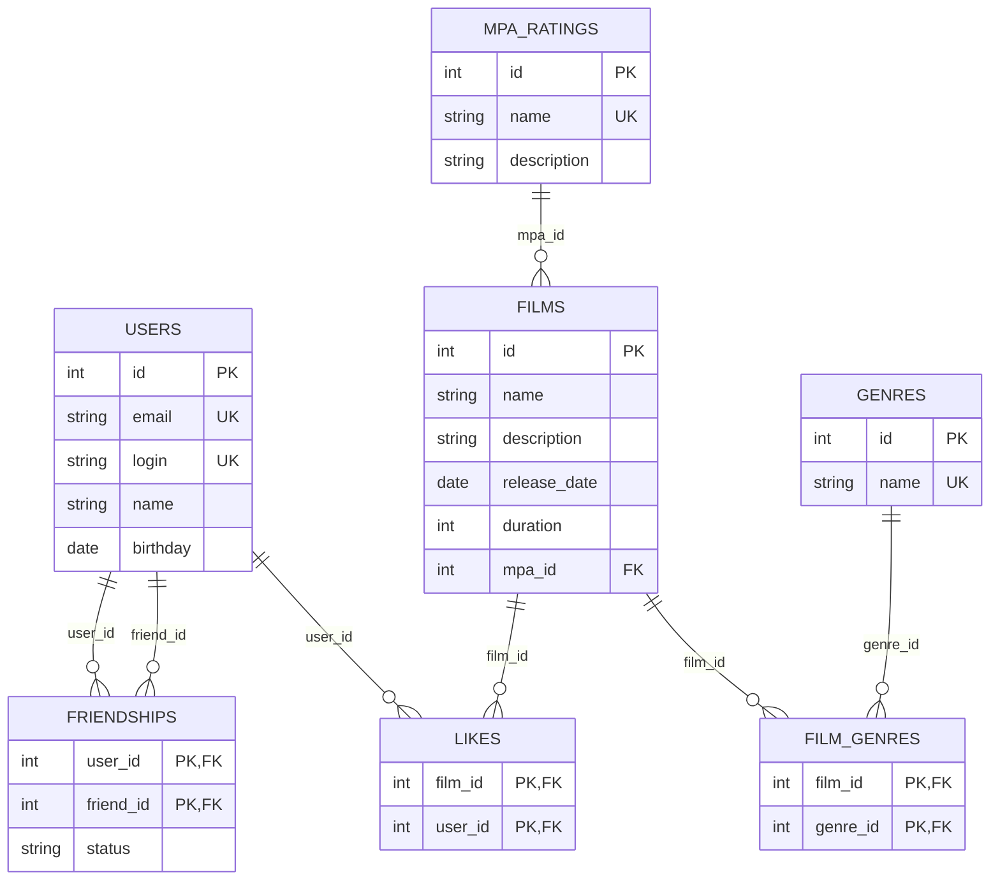

# java-filmorate
Template repository for Filmorate project.

## База данных

### ER диаграмма

```mermaid
erDiagram
    USERS {
        int id PK
        string email UK
        string login UK
        string name
        date birthday
    }
    
    MPA_RATINGS {
        int id PK
        string name UK
        string description
    }
    
    GENRES {
        int id PK
        string name UK
    }
    
    FILMS {
        int id PK
        string name
        string description
        date release_date
        int duration
        int mpa_id FK
    }
    
    FILM_GENRES {
        int film_id PK,FK
        int genre_id PK,FK
    }
    
    LIKES {
        int film_id PK,FK
        int user_id PK,FK
    }
    
    FRIENDSHIPS {
        int user_id PK,FK
        int friend_id PK,FK
        string status
    }
    
    USERS ||--o{ FRIENDSHIPS : "user_id"
    USERS ||--o{ FRIENDSHIPS : "friend_id"
    USERS ||--o{ LIKES : "user_id"
    FILMS ||--o{ LIKES : "film_id"
    FILMS ||--o{ FILM_GENRES : "film_id"
    GENRES ||--o{ FILM_GENRES : "genre_id"
    MPA_RATINGS ||--o{ FILMS : "mpa_id"
```